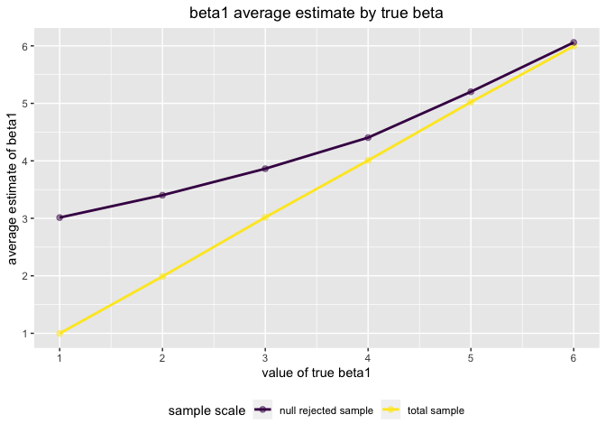

Homework 5
================
Connie Zhang

# Problem 1

``` r
set.seed(10)

iris_with_missing = iris %>% 
  map_df(~replace(.x, sample(1:150, 20), NA)) %>%
  mutate(Species = as.character(Species))

#function to fill missing values
na_function = function(x) {
  if (is.numeric(x) == T) { 
x = x %>%  replace_na(mean(x, na.rm = T))
}
  
  else if (is.character(x) == T) { 
x = x %>%  replace_na("virginica")
} 

  return(x)
}

#map function over iris_with_missing
iris_with_missing =
  map_df(iris_with_missing, na_function)

iris_with_missing
```

    ## # A tibble: 150 x 5
    ##    Sepal.Length Sepal.Width Petal.Length Petal.Width Species
    ##           <dbl>       <dbl>        <dbl>       <dbl> <chr>  
    ##  1         5.1          3.5         1.4         0.2  setosa 
    ##  2         4.9          3           1.4         0.2  setosa 
    ##  3         4.7          3.2         1.3         0.2  setosa 
    ##  4         4.6          3.1         1.5         1.19 setosa 
    ##  5         5            3.6         1.4         0.2  setosa 
    ##  6         5.4          3.9         1.7         0.4  setosa 
    ##  7         5.82         3.4         1.4         0.3  setosa 
    ##  8         5            3.4         1.5         0.2  setosa 
    ##  9         4.4          2.9         1.4         0.2  setosa 
    ## 10         4.9          3.1         3.77        0.1  setosa 
    ## # … with 140 more rows

# Problem 2

``` r
tidy_files = list.files(path = "./data",full.names = TRUE) %>%
  map(read.csv) %>% 
  reduce(rbind) %>% 
  janitor::clean_names() %>%
  mutate(subject_id = c(1:20), 
    arm = ifelse(subject_id == c(1:10), "control","experimental")) %>%      gather(key = week, value = observation, week_1:week_8) %>% 
  mutate(week = str_replace(week, "week_", ""))
```

``` r
 tidy_files %>% 
  ggplot(aes(x = week, y = observation)) + geom_line(aes(group = subject_id, color = arm)) + 
  labs(
    title = "Observations of Subjects over Time", 
    x = "Week Number",
    y = "Observation", 
    caption = "Longitudinal study data for control and experimental arms") +
  theme(legend.position = "bottom")
```

<!-- -->

  - Over the 8 week period, the experimental arm gradually shows higher
    observation values compared to the control arm. Specifically after
    the first 2-3 weeks, the two arms begin to deviate significantly
    from each other. The control arm oscillates around similar values
    consistently throughout 8 weeks while experimental arm increases
    over the same observational period.

# Problem 3

``` r
set.seed(10)

#fix values, define model and get estimate/p-value
sim_regression = function(n = 30, beta0 = 2, beta1 = 0) {
  
  sim_data = tibble(
  x = rnorm(n, mean = 0, sd = 1),
  y = beta0 + beta1 * x + rnorm(n, 0, sqrt(50))
)
  
  ls_fit = lm(y~x, data = sim_data) %>%
  broom::tidy()

  tibble(
    beta_1_hat = ls_fit[[2,2]],
    beta_1_p = ls_fit[[2,5]]
  )
}
```

``` r
# generating 10,000 datasets
set.seed(10)

list_ten_thousand =
  rerun(10000, sim_regression(beta1 = 0)) %>% 
  bind_rows()

list_ten_thousand
```

    ## # A tibble: 10,000 x 2
    ##    beta_1_hat beta_1_p
    ##         <dbl>    <dbl>
    ##  1     -2.44    0.0895
    ##  2     -0.366   0.769 
    ##  3      2.10    0.0917
    ##  4     -0.963   0.431 
    ##  5      1.61    0.192 
    ##  6      0.213   0.880 
    ##  7     -1.99    0.219 
    ##  8      2.15    0.252 
    ##  9      0.421   0.773 
    ## 10      0.685   0.532 
    ## # … with 9,990 more rows

``` r
# Beta1 for values 1-6 
set.seed(10)

beta1_regenerate = 
  tibble(new_beta1 = c(1,2,3,4,5,6)) %>% 
  mutate(
    output_lists = map(.x = new_beta1, ~rerun(10000, sim_regression(beta1 = .x))),
    estimate_dfs = map(output_lists, bind_rows)) %>% 
    select(-output_lists) %>% 
    unnest(estimate_dfs)
```

``` r
# plot for power of test

beta1_regenerate %>%
filter(beta_1_p < 0.05) %>%
  group_by(new_beta1) %>%
  summarize(
    proport_reject = n()/10000
  ) %>%
  
ggplot(aes(x = new_beta1, proport_reject, color = proport_reject)) + 
    geom_point(size = 2, alpha = 0.5) + geom_smooth() +
    labs(title = "Proportion of times that null was rejected by true beta1 value", x="true beta1 value", y="proportion of rejection") +
    theme(plot.title = element_text(hjust = 0.5),legend.position = "none") +
    scale_x_continuous(
    breaks = c(0,1,2,3,4,5,6), 
    labels = c(0,1,2,3,4,5,6)) 
```

    ## `geom_smooth()` using method = 'loess' and formula 'y ~ x'

    ## Warning in simpleLoess(y, x, w, span, degree = degree, parametric =
    ## parametric, : Chernobyl! trL>n 6
    
    ## Warning in simpleLoess(y, x, w, span, degree = degree, parametric =
    ## parametric, : Chernobyl! trL>n 6

    ## Warning in sqrt(sum.squares/one.delta): NaNs produced

    ## Warning in stats::qt(level/2 + 0.5, pred$df): NaNs produced

<!-- --> \*
There seems to be a linear relation between the true value of beta and
power of the test; As the true beta increases, the power of the test
also increases.

``` r
# plot avg estimates of beta1

avg_pop = 
  beta1_regenerate%>%
  group_by(new_beta1) %>%
  summarize(
    mean_beta1 = mean(beta_1_hat)
  ) %>%
  mutate(group = rep("total sample"))

avg_samp = beta1_regenerate %>%
  filter(beta_1_p < 0.05) %>%
  group_by(new_beta1) %>%
  summarize(
    mean_beta1 = mean(beta_1_hat)
  ) %>%
  mutate(group = rep("null rejected sample"))
mean_beta1 = bind_rows(avg_pop, avg_samp) 

ggplot(mean_beta1, aes(x = new_beta1, y = mean_beta1, group = group, color = group)) + 
  geom_point(size = 2, alpha = 0.5) +
  geom_line(size = 1) +
  labs(title = "beta1 average estimate by true beta", x="value of true beta1", y="average estimate of beta1") +
  viridis::scale_color_viridis(
    name = "sample scale", 
    discrete = TRUE
  ) +
  theme(plot.title = element_text(hjust = 0.5),legend.position = "bottom") +
  scale_x_continuous(
    breaks = c(1,2,3,4,5,6), 
    labels = c(1,2,3,4,5,6)) + 
  scale_y_continuous(
    breaks = c(1,2,3,4,5,6), 
    labels = c(1,2,3,4,5,6))
```

<!-- -->

  - As true value of beta1 increases, the difference between the two
    tests become smaller. The sample average of `beta_1_hat` across
    tests for which null is rejected does not equal true value of
    beta\_1 since there is such a difference when beta 1 is small.
